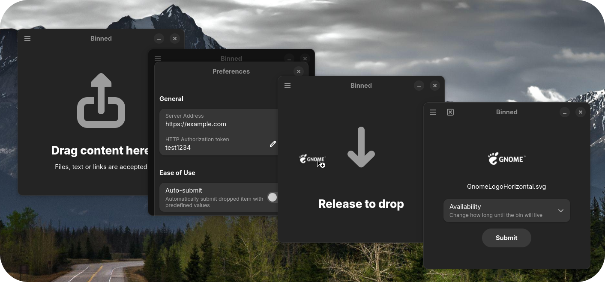

    <picture>
        
    </picture>
    <h1 style="text-align: center;">Binned</h1>

<picture>
    
</picture>

An (almost complete) easy-to-use app for uploading pastes to a [RustyPaste](https://github.com/orhun/rustypaste) instance. \
Written in [Vala](https://vala.dev/) with [libadwaita](https://gnome.pages.gitlab.gnome.org/libadwaita/)

## Features
- HTTP authorization token
- Customizable expiration time
- Oneshot bin
- Dropped text support (both `text/plain` and URLs)
- Auto-submit with predefined availablity settings 
- Set custom filename for upload - WIP
- More to come

## Installation
## Translating
## Contributing
## Licensing
All code is licensed under the [GPL-3.0 license](https://github.com/Zateros/Binned/blob/main/COPYING)
